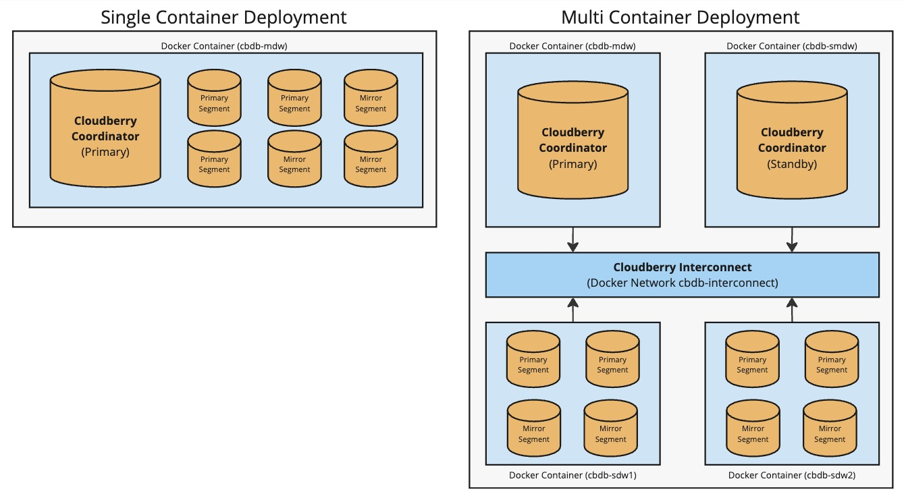

# Install Cloudberry Database With Docker

This document guides you on how to quickly set up and connect to a Cloudberry Database in a Docker environment. You can try out Cloudberry Database by performing some basic operations and running SQL commands. 

> [!WARNING]
> This guide is intended for testing or development. DO NOT use it for production.


## Prerequisites

Make sure that your environment meets the following requirements:

- Platform requirement: Any platform with Docker runtime. For details, refer to [Get Started with Docker](https://www.docker.com/get-started/).
- Other dependencies: Git, SSH, and internet connection

## Build the Sandbox

When building and deploying CloudBerry in Docker, you will have 2 different deployment options as well as different build options.

**Deployment Options**
1. **Single Container** (Default) - With the single container option, you will have the coordinator as well as the Cloudberry segments all running on a single container. This is the default behavior when deploying using the `run.sh` script provided.
2. **Multi-Container** - Deploying with the multi-container option will give you a more realistic deployment of what actual production Cloudberry clusters look like. With multi-node, you will have the coordinator, the standby coordinator, and 2 segment hosts all on their own respective containers. This is to both highlight the distributed nature of Cloudberry Database as well as highlight how high availability (HA) features work in the event of a server (or in this case a container) failing. This is enabled by passing the -m flag to the `run.sh` script which will be highlighted below.



**Build Options**

> [!CAUTION]
> CentOS Linux 7 reached it's end of life (EOL) on June 30, 2024. The software source mirror (vault) only supports x86_64, the `altarch` source (like ARM) has been deprecated. So you cannot run the CentOS 7 sandbox on your macBook with M1/2. 

1. Compile with the source code of the latest Cloudberry Database (released in [Cloudberry Database Release Page](https://github.com/cloudberrydb/cloudberrydb/releases)). The base OS will use a CentOS 7.9 Docker image.
2. Method 2 - Compile with the latest Cloudberry Database [main](https://github.com/cloudberrydb/cloudberrydb/tree/main) branch. The base OS will use a Rocky Linux 9 Docker image.

Build and deploy steps:

1. Start Docker Desktop and make sure it is running properly on your host platform.

2. Download this repository (which is [cloudberrydb/bootcamp](https://github.com/cloudberrydb/bootcamp)) to the target machine.

    ```shell
    git clone https://github.com/cloudberrydb/bootcamp.git
    ```

3. Enter the repository and run the `run.sh` script to start the Docker container. This will start the automatic installation process. Depending on your environment, you may need to run this with 'sudo' command.

    - For latest Cloudberry DB release running on a single container

    ```shell
    cd bootcamp/000-cbdb-sandbox
    ./run.sh
    ```
    - For latest Cloudberry DB release running across multiple containers

    ```shell
    cd bootcamp/000-cbdb-sandbox
    ./run.sh -m
    ```
    - For latest main branch running on a single container

    ```shell
    cd bootcamp/000-cbdb-sandbox
    ./run.sh -c main -o rockylinux9
    ```

    - For latest main branch running across multiple containers

    ```shell
    cd bootcamp/000-cbdb-sandbox
    ./run.sh -c main -o rockylinux9 -m
    ```

    Once the script finishes without error, the sandbox is built and running successfully. The `docker run` and `docker compose` commands use the --detach option allowing you to ssh or access the running CBDB instance remotely.

    Please review run.sh script for additional options (e.g. setting Timezone in running container, only building container). You can also execute `./run.sh -h` to see the usage.

## Connect to the database

You can now connect to the database and try some basic operations.

1. Connect to the Docker container from the host machine:

    ```shell
    docker exec -it cbdb-mdw /bin/bash
    ```

    If it is successful, you will see the following prompt:

    ```shell
    [root@mdw /]$
    ```

2. Log into Cloudberry Database in Docker. See the following commands and example outputs:

    ```shell
    [root@mdw /] su - gpadmin  # Switches to the gpadmin user.
    
    # Last login: Tue Oct 24 10:26:14 CST 2023 on pts/1
    
    [gpadmin@mdw ~]$ psql  # Connects to the database with the default database name "gpadmin".
    
    # psql (14.4, server 14.4)
    # Type "help" for help.
    ```

    ```sql
    gpadmin=# SELECT VERSION();  -- Checks the database version.
                                                                                            version
    
    -----------------------------------------------------------------------------------------------------------------------------------------------------------------------------------
    -----
    PostgreSQL 14.4 (Cloudberry Database 1.0.0 build dev) on aarch64-unknown-linux-gnu, compiled by gcc (GCC) 10.2.1 20210130 (Red Hat 10.2.1-11), 64-bit compiled on Oct 24 2023 10:24:28
    (1 row)
    ```

In addition to using the `docker exec` command, you can also use the `ssh` command. This command will connect to the database with the default database name `gpadmin`:

```shell
ssh gpadmin@localhost # Password: cbdb@123
```

Now you have a Cloudberry Database and can continue with [Cloudberry Database Tutorials Based on Docker Installation](https://github.com/cloudberrydb/bootcamp/blob/main/101-cbdb-tutorials/README.md)! Enjoy!

## Working with your Cloudberry Docker environment

When working with the Cloudberry Docker environment there are a few commands that will be useful to you.

**Stopping Your Single Container Deployment With Docker**

To stop the **single container** deployment while _keeping the data and state_ within the container, you can run the command below. This means that you can later start the container again and any changes you made to the containers will be persisted between runs.

```shell 
docker stop cbdb-mdw
```

To stop the **single container** deployment and also remove the volume that belongs to the container, you can run the following command. Keep in mind this will remove the volume as well as the container associated which means any changes you've made inside of the container or any database state will be wiped and unrecoverable.

```shell 
docker rm -f cbdb-mdw
```

To stop the **multi-container** deployment while _keeping the data and state_ within the container, you can run the command below by subsituting the <docker-compose-OS.yml> argument with whichever docker-compose file is associated with your deployment (Rocky Linux 9 or CentOS). This means that you can later start the container again and any changes you made to the containers will be persisted between runs.

```shell 
docker compose -f <docker-compose-OS.yml> stop
```

To stop the **multi-container** deployment while _keeping the data and state_ within the container, you can run the command below by subsituting the <docker-compose-OS.yml> argument with whichever docker-compose file is associated with your deployment (Rocky Linux 9 or CentOS). Running this command means it will delete the containers as well as remove the volumes that the containers are associated with. This means any changes you've made inside of the containers or any database state will be wiped and unrecoverable. 

```shell 
docker compose -f <docker-compose-OS.yml> down
```

**Starting A Stopped Cloudberry Docker Deployment**

If you've run any of the commands above that keep the Docker volumes persisted between shutting the containers down, you can use the following commands to bring that same deployment back up with it's previous state.

To start a **single container** deployment after it was shut down, you can simply run the following

```shell 
docker start cbdb-mdw
```

To start a **multi-container** deployment after it was shut down, you can run the following command by subsituting the <docker-compose-OS.yml> argument with whichever docker-compose file is associated with your deployment (Rocky Linux 9 or CentOS).

```shell 
docker compose -f <docker-compose-OS.yml> start
```

